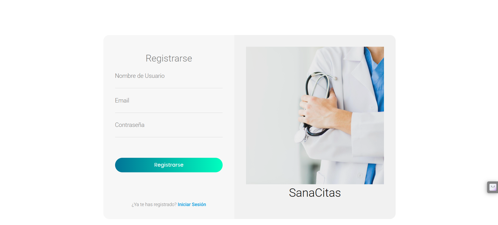
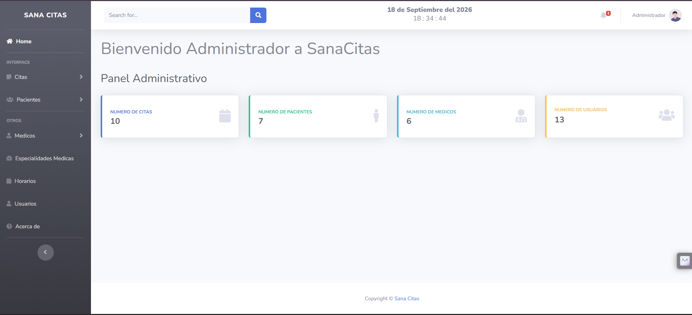
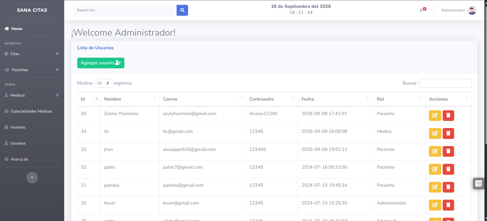
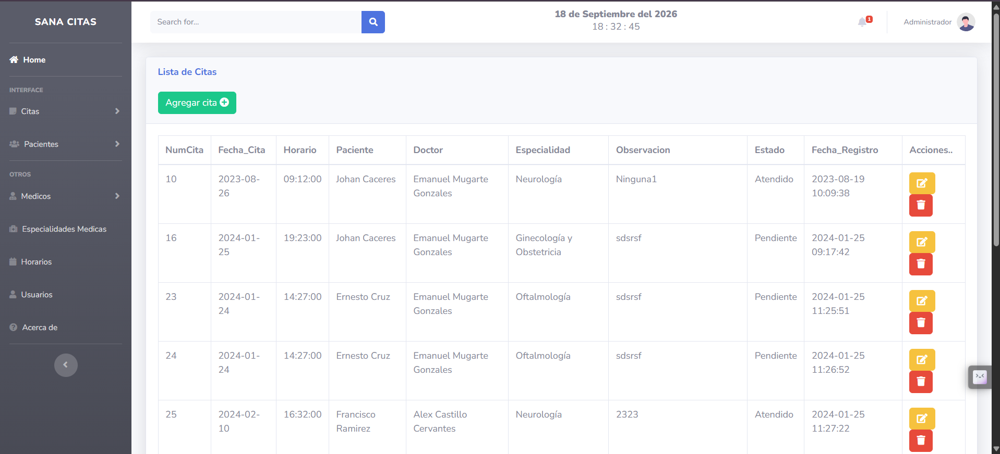
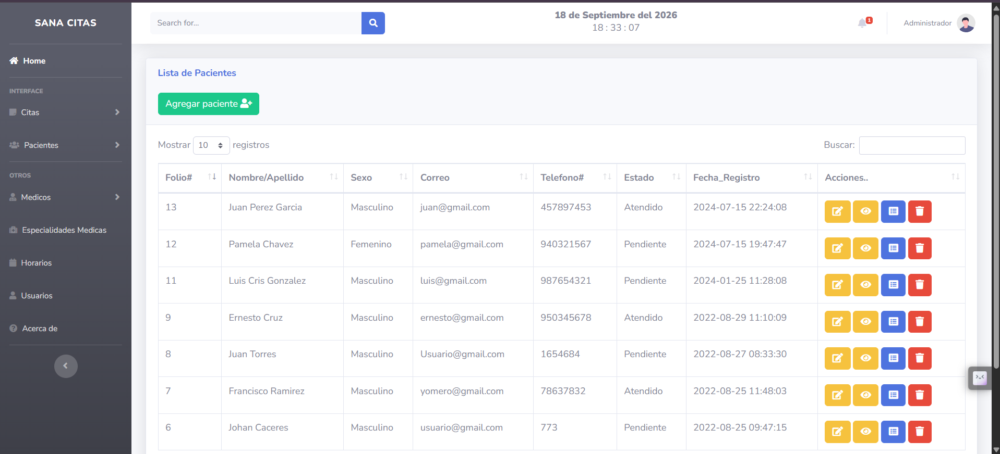
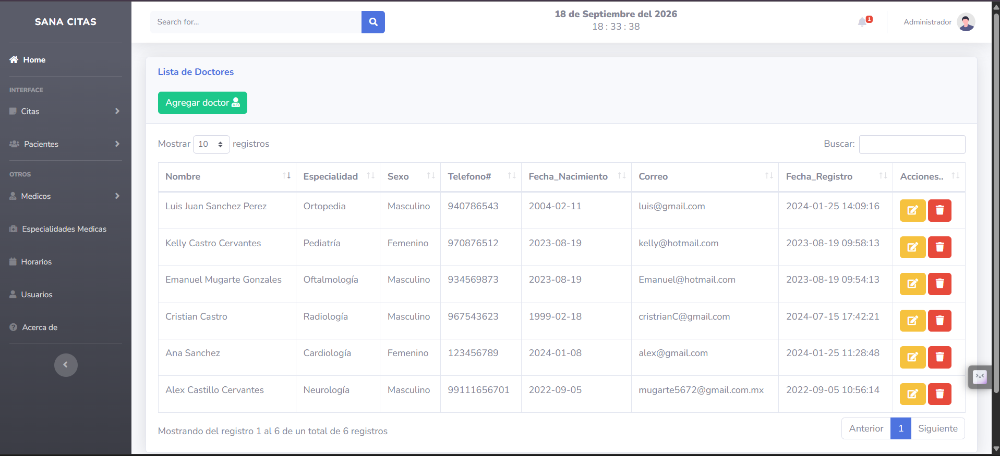
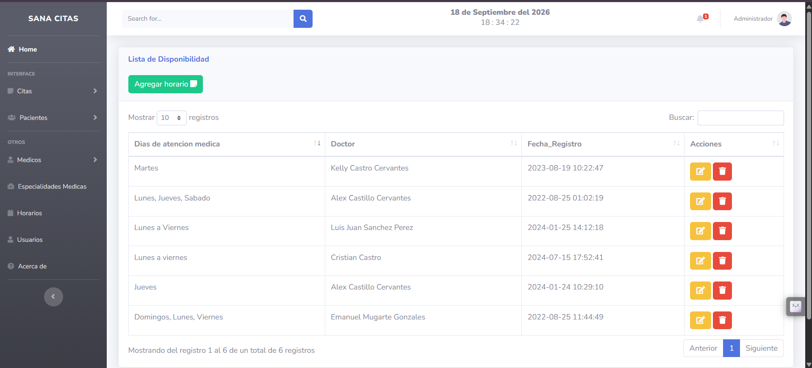
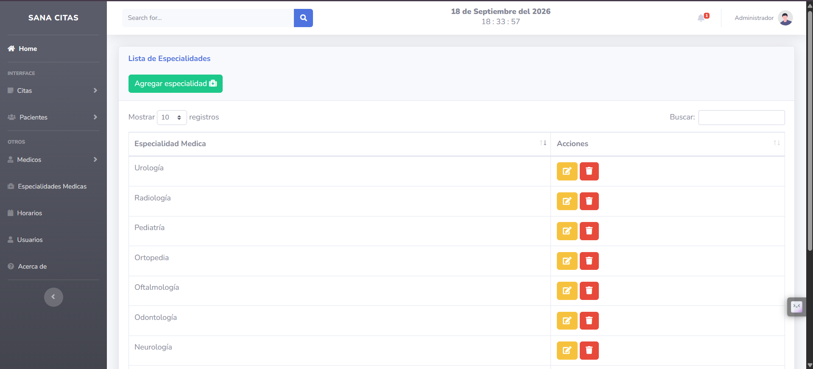

# SanaCitas

Sistema web para la gestión de citas médicas de una clínica de atención primaria. Centraliza el registro de pacientes, médicos, especialidades, horarios y citas en una interfaz administrativa.

> Proyecto desarrollado con fines académicos y de portafolio.

## Vista previa

Las siguientes vistas muestran los módulos principales de SanaCitas.

| Inicio de sesión | Registro de usuario |
| --- | --- |
|  |  |
| Acceso de usuarios al sistema mediante sus credenciales. | Formulario para registrar nuevas cuentas para los usuarios. |

| Panel administrativo | Gestión de usuarios |
| --- | --- |
|  |  |
| Resumen de los registros de citas, pacientes, médicos y usuarios. | Administración de cuentas del sistema según los roles disponibles. |

| Gestión de citas | Gestión de pacientes |
| --- | --- |
|  |  |
| Registro y seguimiento de citas por fecha, hora, paciente, médico y especialidad. | Consulta y administración de la información clínica y de contacto de los pacientes. |

| Gestión de médicos | Horarios de atención |
| --- | --- |
|  |  |
| Registro del personal médico y su especialidad asignada. | Organización de los días de atención asociados a cada médico. |

| Especialidades médicas |
| --- |
|  |
| Catálogo de especialidades disponible para la asignación de médicos y citas. |

> Las capturas contienen datos de demostración. Para publicaciones externas, usa información ficticia o difumina datos personales.

## Funcionalidades principales

- Autenticación de usuarios y control de acceso según rol: administrador, empleado, paciente y médico.
- Panel administrativo con indicadores de citas, pacientes, médicos y usuarios registrados.
- Registro, edición, consulta y eliminación de citas médicas.
- Gestión de pacientes, médicos, usuarios, especialidades y horarios de atención.
- Asociación de médicos con sus especialidades y carga dinámica de especialidades al registrar una cita.
- Actualización del historial clínico del paciente: antecedentes, enfermedades y estado de atención.
- Generación de historial clínico en PDF.
- Tablas interactivas y confirmación visual antes de eliminar registros.

## Tecnologías y herramientas

| Área | Tecnologías |
| --- | --- |
| Backend | PHP 8, MySQLi |
| Base de datos | MySQL / MariaDB |
| Frontend | HTML5, CSS3, JavaScript, jQuery |
| Interfaz | Bootstrap, SB Admin 2, Font Awesome |
| Componentes | DataTables, SweetAlert2, AJAX |
| Documentos | FPDF |
| Entorno local sugerido | XAMPP (Apache + MySQL/MariaDB) |


## Estructura del proyecto

```text
citas_medicas/
├── css/                 # Estilos de la aplicación
├── docs/capturas/       # Capturas para README y portafolio
├── img/                 # Imágenes y recursos visuales
├── includes/            # Conexión, sesiones, formularios y lógica PHP
├── js/                  # Scripts de interfaz
├── package/             # Librerías SweetAlert2 y FPDF
├── views/               # Vistas administrativas
├── index.php            # Punto de entrada
```

## Próximas mejoras

- Aplicar hash de contraseñas y validación exhaustiva de datos en el servidor.
- Usar consultas preparadas para reforzar la seguridad de la base de datos.
- Incorporar agenda visual, notificaciones y filtros de disponibilidad.
- Añadir pruebas automatizadas y configuración de despliegue.

## Nota de seguridad

Este repositorio está orientado a demostración. No debe utilizarse con datos clínicos reales sin implementar controles de seguridad, protección de datos, auditoría y políticas de acceso adecuadas.
